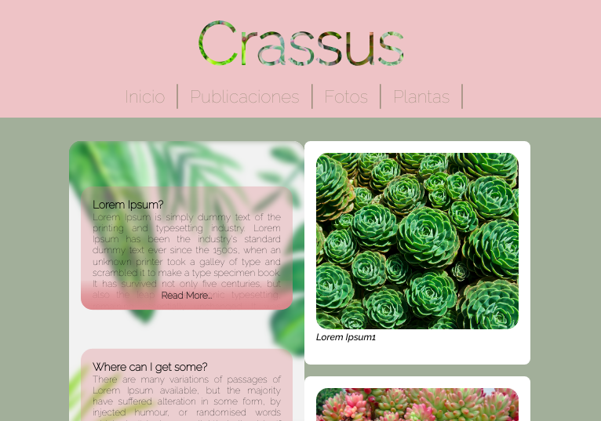

# Crassus page :cactus:

This is the upgraded version of the first [Crassus page](https://github.com/susird/crassus-basic), created with vanilla Javascript, HTML and CSS.

This project was served using the  Live Server vscode extension. :satellite:

## Things I learned
* Develop an appropriate project structure.
* How to do a Json document, structure and syntax.
* Import and export data from external files.
* Render the different components of the app in an html node.
* Crate functions to create components from HTML.
* Components are with Pascal case.
* Use the VScode server extension.
* Object destructuring.
* Create a pull Request for each branch.
* Create ul and li to iterate and interpolate in data elements.
* How to disappear an element with Js and css styles.
* Receive feedback and make code correction.
* How to update Master when changes are made to a feature branch.

## Acknowledgment
I would like to thank to [Any Ruiz](https://github.com/anyruizd) and [Jose Miguel](https://github.com/josepplloo) for teaching me with patience and not giving up on me. I learned a lot from you.:hearts: